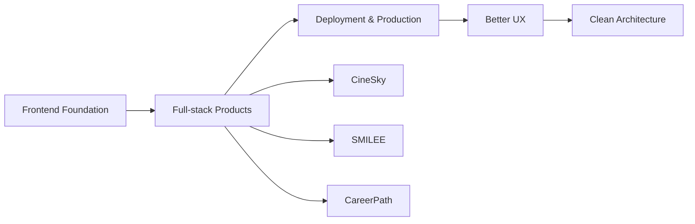

<p align="center">
  
</p>

<h1 align="center">Hi, I'm Hieu</h1>

<p align="center">
  I build clean, responsive web pages and keep learning full-stack development through real projects.
</p>

<p align="center">
  <a href="https://github.com/Hiu11">
    
  </a>
  <a href="https://cine-sky-fe.vercel.app/">
    
  </a>
  <a href="https://smilee-frontend.vercel.app/">
    
  </a>
  <a href="https://fe-carrer-path-website.vercel.app/">
    
  </a>
</p>

---

## About Me

```ts
const hieu = {
  name: "Do Trong Hieu",
  location: "Ho Chi Minh City",
  focus: ["Frontend UI", "Full-stack web apps", "Clean responsive pages"],
  currentStack: ["React", "TypeScript", "Vite", "Tailwind CSS", "Express", "MongoDB"],
  learning: ["Next.js", "NestJS", "Prisma", "PostgreSQL", "FastAPI", "Vue 3"],
  mindset: "Build from real projects, improve from real feedback.",
};
```

---

## Tech Stack

<p align="center">
  
</p>

---

## Featured Projects

| Project | Description | Tech | Live | Source |
|---|---|---|---|---|
| CineSky Movie Web | Full-stack movie ticket booking web app with admin dashboard, AI assistant, and Vercel deployment. | React, Express, MongoDB, JavaScript | [Live](https://cine-sky-fe.vercel.app/) | [Repo](https://github.com/Hiu11/CineSky-Movie-web) |
| SMILEE | Full-stack dental clinic management system. | Next.js, NestJS, Prisma, PostgreSQL, Tailwind CSS, TypeScript | [Live](https://smilee-frontend.vercel.app/) | [Repo](https://github.com/Hiu11/SMILEE) |
| CareerPath Frontend | Frontend for a career roadmap platform with dashboard progress tracking. | React, TypeScript, Vite, Vercel | [Live](https://fe-carrer-path-website.vercel.app/) | [Repo](https://github.com/Hiu11/FE_CarrerPath_Website) |
| CareerPath Backend | Backend API for authentication, roadmap progress, profile, quiz, and dashboard APIs. | Express, TypeScript, MongoDB | - | [Repo](https://github.com/Hiu11/BE_CarrerPath_Website) |
| MindX Fullstack Final Test | Teacher management MERN app with pagination, position management, and avatar upload. | React, Vite, Express, MongoDB, JavaScript | - | [Repo](https://github.com/Hiu11/MINDX_FULLSTACK_FINAL_TEST) |
| EduPress | Online learning platform. | Vue 3, FastAPI, PostgreSQL | - | [Repo](https://github.com/Hiu11/EDUPRESS) |

---

## GitHub Stats

<p align="center">
  
  
</p>

<p align="center">
  
</p>

<p align="center">
  
</p>

---

## 2026 Focus



---

<p align="center">
  
</p>

<p align="center">
  
</p>
